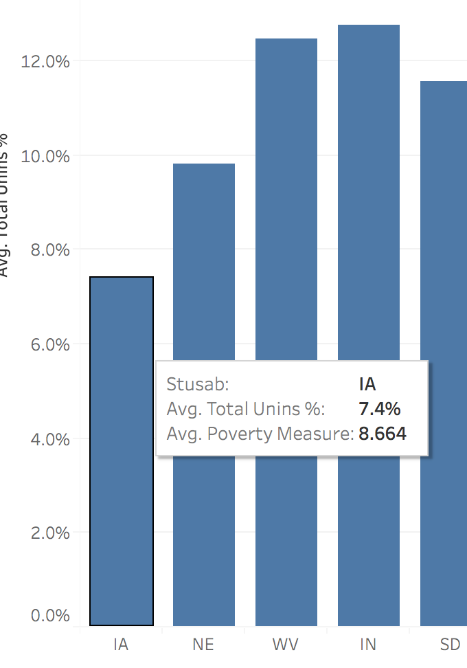

# dsc-etl-cumulative-lab-part-d-tableau-dashboarding

# TODO

- General review for clarity / copy-editing
- Creation and linking of `setting up data.world and Tableau` instructions

## Introduction
You've completed the SQL section of the ETL cumulative lab - excellent work.  Now we're going to analyze the data about health insurance and poverty rates you queried.  

You'll get practice transfering data across tools, manipulating that data in Tableau, and constructing a dashboard.

The steps of this lab will prepare you for doing the project at the end of the Phase, so you are *highly* encouraged to complete it!

## Objectives
You will be able to:

- Combine data in Tableau from "online" SQL queries and "offline" local files

- Construct calculated fields in Tableau to visualize a relationship
   - Transform and combine individual variables 
   - Create metrics by combining the transformed variables
   
   
- Make that visualization dynamic

   - Create new metrics which can be user-selected and alter visualizations dynamically
   - Link dynamic filter schemes to multiple visualizations


- Construct a dashboard with multiple visualizations and dynamic text

## Your Task:

Construct a dashboard of different measures of poverty that break down the uninsured percentage of the US in different ways.

### Business Understanding

A non-profit group has commissioned you with the task of creating a dashboard for part of their series of investigations on health insurance and poverty.

As part of a public-facing campaign, they would like visitors to their website to be able to interact with a dashboard in which they can answer the following questions:

- What is the overall uninsured percentage in the US overall?
- What are the differences in uninsured percentage across different states?
- What is the relationship between different measures of poverty and uninsured percentage?
- What is the relationship between different measures of poverty and uninsured percentage across different states?

Businesses often have specific contraints on the **type** of dataset and **nature** of the data pipeline to be used.  This non-profit is no different! 

They require a data source that is **comprehensive, stable, and easily publicly accessible**:
- **Comprehensive** so that the data reflects a total health insurance and poverty picture
- **Stable** so that the non-profit can: 
   - not have to worry about how updates to a dataset might affect the dashboard
   - not have to worry about updating its data pipeline to feed data to the dashboard
- **Easily publicly accessible** so that the non-profit can link to and encourage further exploration of the data, and advance one of its missions of encouraging data exploration among the public

### Data Understanding

In Part B of this cumulative lab, you pulled data from two specific topics of the 2011-2015 American Community Survey, `Health Insurance` and `Poverty`.

This fullfils the non-profit's data requirements:
- The ACS is a **comrehensive** survey of American society, and contains methodologically-sound data at multiple subsets of geography.

- The 2011-2015 5-year survey is **stable** in a way that ACS surveys in individual years are not.  
   - Individual years can have methodological updates and re-calculations to them after they are released.  The 5-year survey is designed to be a robust compilation that won't be updated.
   
   - The 2011-2015 5-year survey does **not** capture every variable over time, and **none** of the variables pulled in the SQL query vary over time.  The 2011-2015 5-year survey reflects the value of those variables **during the period 2011-2015**.  
   
- The 2011-2015 ACS survey is hosted on `data.world`, an open-source data platform which has been around for years.
   - We can be reasonably sure of `data.world`s **stability**.  Certainly *more* stable options exist, such as a `.csv` file hosted on the non-profit's servers, but there's no reason to think the `data.world` data pipeline won't continue working for years.
   - `data.world` is also user-friendly as a data platform, and has relatively accessible ETL tools.  This makes it ideal as an **easily publicly accessible** platform which is useful to use for the non-profit's mission.
   
The SQL query you made in resulted in a dataset where each `row` had a `Zip Code Tabulation Area` (`zcta`) and additional `health insurance` and `Poverty` variables.

The specific variables in that SQL query were:

**`Health insurance`**
- `Total Uninsured people`
- `Total Insured people`
- `Total population` based on insurance information (adding `Total Uninsured people` and `Total Insured people` together)

**`Poverty`**
- `Native-born people in poverty`
- `Native-born people not in poverty`
- `Foreign-born people in poverty`
- `Foreign-born people not in poverty`

#### A note on total population

Note that there isn't a "total population" variable in this query.  Since the population for whom `insurance` information was gathered is **different** from the population in which `poverty` information is gathered, we have two **slightly different** measures of total population if we added up "everyone with health insurnace information" and "everyone with poverty information".

These differences for each `zcta` are **not large**, and often the total people who provide health insurance info and proverty info in a `zcta` come out to the same number.  But there are `zcta`s with small differences between the two.

#### A note on Zip Code Tabulation Areas

**General definition**

A `zcta` is the geograhic unit the US Census, as well as the American Community Survey, uses to aggregate smaller-sized "census blocks" before aggregating up into "states". 

**Overlap among states**

Out of the 40,000+ `zcta`s, around 200 fall between two states.  (There are none that fall in three states).  


**Relationship to `zip codes`**

A `zip code` is a geographic unit used by the USPS to deliver mail.

A `zcta` is **similar** to a `zip code` geographically, and there is extensive overlap between a given `zip code` and a given `zcta`.  But, they are not congruous; we can **not** say that any given `zip code` and `zcta` match the same exact area in the real world.  There are edge cases in including / not including specific census blocks in a given `zcta` which `zip codes` do not have to take into account.

As such, you can think to yourself "`zcta` is close enough to `zip code` to mean roughly the same thing", but keep in mind that there could be differences between any given `zip code` and any given `zcta`.

### Requirements

#### 1. Construct Calculated Fields

Within the Tableau book you set up in Part C, construct the calculated fields necessary for the dashboard.

#### 2. Construct Visualizations and Display Calculations

Use the calculated fields constructed above to create visualizations and display overall calculations.   

#### 3. Make it Dynamic!

Create parameters and filter settings to incorporate into the visualizations and displayed calculations in order to make them dynamic.  

#### 4. Create a Dashboard

Combine the visualizations you created into a dashboard into a pleasing layout, accompanied with dynamic text that contextualizes the visualizations. 

### Checking for Understanding

**Question 1**. What is our unit of analysis, and what is the unique identifier? In other words, what will one record in our final data structure represent, and what attribute uniquely describes it?


.


.


.

*Answer*: 

    What is our unit of analysis, and what is the unique identifier? In other words, what will one record in our final data structure represent, and what attribute uniquely describes it?
    
Each row represnts a `zip code tabulation area` or `zcta`, and the columns represent information about each `zcta`.  For example, any value of `total uninsured` represents the number of people without health insurance in a specific `zcta`. 


**Question 2**. What are some **limits** to the analysis we can do with the above dataset? **Hint**: think about **time periods** 


.


.


.

*Answer*: 
    
    What are some **limits** to the analysis we can do with the above dataset? **Hint**: think about **time periods** 

We can't look at changes across time, since the data represent one overall time period (2011-2015)


**Question 3**. What are some **caveats** we should make to the analysis we **are** doing?  


.


.


.

*Answer*: 

    What are some **caveats** we should make to the analysis we **are** doing?  
    
1. Because `health insurance` and `poverty` variables are absolute counts of people, and not everyone who provided health insurance information provided poverty information and vice-versa, the **total number of people** in a given `zcta` might be slightly different if we added up all the `health insurance` buckets and compared them to all the people added up in the `poverty` buckets. These are **small differences**, but they reflect a caveat to the data that we have.

2. Because some `zcta`s overlap states, if we roll up `zcta` information into states (which we will do), there will be some double-counting of some `zcta`s across multiple states.  There aren't a lot of these (a few hundred out of 40,000+ total), but enough that they need to be noted.  

## Set up requirements

Before starting this part of the lab, you should have set up already:
- free accounts in `data.world` and `Tableau Public` 
- setting up `data.world` SQL integration with `Tableau Public`
- the Tableau Public software downloaded onto your local machine

If you have not set those up, follow the instructions HERE to get them set up.

You should also have completed Parts A through C of the ETL cumulative lab:
- Part A sets up a project in `data.world` to use two American Community Survey 2011-2015 topic areas: `Health Insurance` and `Poverty`

- Part B writes the SQL code to pull specific variables from the `Health Insurance` and `Poverty` topic areas and transform them

- Part C sets up Tableau to import the SQL pull from `data.world`, as well as joining an additional dataset containing which state each Zip Code Tabulation Area resides within

### Solutions

The link to the URL in Tableau Public hosting this book is at this part of the book in the `solutions` branch, and a copy of the workbook is also in a folder in the solutions branch.


```python
#__SOLUTION__
'''
URL at Tableu Public hosting the book is here: 
https://public.tableau.com/profile/fltest#!/vizhome/ETLcumulativelab/Dashboard1?publish=yes
'''
```

## 1. Construct calculated fields

> Within the Tableau book you set up in Part C, construct the calculated fields and visualizations necessary for the dashboard.

### Construct new measure from `Health Insurance` variables

First, name the first worksheet `Total Uninsured % graph`.  (Remember that each book you make will most likely contain multiple worksheets, and it quickly becomes a pain to remember them all.  Always label a new sheet!)


#### Constructing `Total Unins %`
Next, in the worksheet `Total Uninsured % measure`, construct a new calculated field that will calculate the percentage of the total population in each `zcta` that is uninsured:   

- Open up a new calculated field
- Name it `Total Unins %`
- Provide the calculation to create "percent of the total population uninsured in each `zcta`".  In other words, divide the variable for "total number of uninsured people" by the variable for "total number of people"

Starter code has been provided for you below.  Fill in the `None`s where the numerator and denominator are, and copy/paste that code into the `Total Unins %` calculated field.

(It may seem a bit silly to provide starter code that's just the division bar in a fraction, but this is the setup we'll use for more complex calculated fields later on, so we'll use it now to keep it consistent)


```python
#Fill in the `None`s below with your code, and copy/paste into the "Total Unins %" calculated field

None / None
```


```python
#__SOLUTION__

#Fill in the `None`s below with your code, and copy/paste into the "Total Unins %" calculated field

[Total Unins] / [Total Pop]
```

**Hint**: remember that variable names in the calculated field "syntax" need to be surrounded by square brackets.  For example, if we were using the variable `age` in a calculated field, we would write `[age]`

Next, drag the `Total Unins %` measure you just created into the main graph space: the largest box labeled `Drop field here` in the middle.  The number `4,083` should pop up, and the `Total Unins %` pill should automatically pop up in the `Marks` pane as a `Sum`, as in the screenshot below.


Click on the pill, and in the `Measure` drop-down item, change from `Sum` to `Avg` as in the screenshot below:


**Calculation Check**

The pill in the `Marks` pane should now begin with `AVG` instead of `SUM`, and the number in the main field should now read `.1249`


**Concept Check**

Remember what's going on here: the `Total Unins %` calculated field is constructing a new column with a value for *each row*.  Then, once `Total Unins %` is used in a visualization, Tableau is *aggregating* the `Total Unins %` calculation.  

In this case: the visualization is just a display of the final calcuation. The aggregation is an `avg` of `Total Unins %`. And the `avg` is being taken across *every `zcta`*.  Later, when we build a graph, we will see the `avg` being visualized by *every `zcta` in a* ***given US state***.  

### Construct new measures from `Poverty` variables

We'll now move on to constructing new measures from the `Poverty` variables.  

#### Constructing `Native Poverty Rate`

First, create a **new worksheet** and label it `Poverty Measure`.

Then, create a new calculated field that measures the ratio of **people native-born to the US and in poverty** to **total number of people who are native-born**:

- Open up a new calculated field
- Name it `Native Poverty Rate`
- Provide the calculation to create "percent of the total **native-born** population who are in poverty".  In other words, divide *the number of people who are native-born and in poverty* by *the total number of people who are native-born*

Starter code has been provided for you below.  Fill in the `None`s where the numerator and denominator are, and copy/paste that code into the `Native Poverty Rate` calculated field.


```python
#Fill in the `None`s below with your code, and copy/paste into the "Native Poverty Rate" calculated field

None / (None + None)
```


```python
#__SOLUTION__

#Fill in the `None`s below with your code, and copy/paste into the "Native Poverty Rate" calculated field

[Native Poverty] / ([Native Poverty] + [Native Non Poverty])
```

**Note**: 

Notice that there are two `None`s in the denominator in the starter code.  This is because we didn't create a *total number of people who are native-born* variable from the SQL query in Part B of the ETL cumulative lab.  

You will need to find two variables that, when added together, result in *the total number of native-born people*.

Notice that this is different than when we constructed the `Total Unins %` calculated field above, where we **did** combine variables in the SQL query to have one number we could use in the numerator and denominator.  

The **overall takeaway**: in the ETL process, there are usually multiple ways to combine raw data at different stages of the process to get the same results!  Where you combine variables, and within what tools you combine them, is part of the skill of doing ETL tasks.  

**Calculation Check**: 

If you drag the `Native Poverty Rate` pill into the largest box that reads `Drop field here` and change the "aggregation" from `SUM` to `AVG` (as we did with `Total Unins %` above) the number displayed should be `.08625`

**Hints**: 

- If you get an error in constructing `Native Poverty Rate`:
   - Remember that variables in calculated fields need square brackets around them to identify them as variables
   - Check that the parenthesis is in the right spot for the denominator. 


- When you try and drag the `Native Poverty Rate` pill into the main field to display the calculation, does the pill pop up in the `Marks` pane?  If not, you aren't putting the pill in the right place.


- Does a number for the calculation pop up but it's wildly inaccurate?  Remember to change the default aggregation, `SUM`, to `AVG` by clicking on the pill in the `Marks` pane, as we did with constructing `Total Unins %` above.

#### Constructing `Foreign Poverty Rate`

Once you check your work for `Native Poverty Rate`, drag the `Native Poverty Rate` pill **out of** the `Marks` pane, so that there is **no longer** a calculated number being displayed.

Next, while still staying within the `Poverty measure` sheet, we'll follow the same process for constructing `Foreign Poverty Rate`.

Create a new calculated field that measures the ratio of **people who are foreign-born and in poverty** to **total number of people who are foreign-born**:

- Open up a new calculated field
- Name it `Foreign Poverty Rate`
- Provide the calculation to create "percent of the total **foreign-born** population who are in poverty".  In other words, divide *the number of people who are foreign-born and in poverty* by *the total number of people who are foreign-born*

Starter code has been provided for you below.  Fill in the `None`s where the numerator and denominator are, and copy/paste that code into the `Foreign Poverty Rate` calculated field.


```python
#Fill in the `None`s below with your code, and copy/paste into the "Native Poverty Rate" calculated field

None / (None + None)
```


```python
#__SOLUTION__

#Fill in the `None`s below with your code, and copy/paste into the "Native Poverty Rate" calculated field

[Foreign Poverty] / ([Foreign Poverty] + [Foreign Non Poverty])
```

**Calculation Check**: 

If you drag the `Foreign Poverty Rate` pill into the largest box that reads `Drop field here` and change the "aggregation" from `SUM` to `AVG` (as we did with `Total Unins %` and `Native Poverty Rate` above) the number displayed should be `.2883`

**Hints**: 

- If you get an error in constructing `Foreign Poverty Rate`:
   - Remember that variables in calculated fields need square brackets around them to identify them as variables
   - Remember that variable names don't need strings in them, so don't use quotation marks
   - Check that the parenthesis is in the right spot for the denominator. 


- When you try and drag the `Native Poverty Rate` pill into the main field to display the calculation, does the pill pop up in the `Marks` pane?  If not, you aren't putting the pill in the right place.


- Does a number for the calculation pop up but it's wildly inaccurate?  Remember to change the default aggregation, `SUM`, to `AVG` by clicking on the pill in the `Marks` pane, as we did with constructing `Total Unins %` and `Native Poverty Rate` above.

#### Constructing `Overall Poverty Rate`

Once you check your work for `Foreign Poverty Rate`, drag the `Foreign Poverty Rate` pill **out of** the `Marks` pane, so that there is **no longer** a calculated number being displayed.

Next, while still staying within the `Poverty measure` sheet, we'll follow the same process for constructing `Overall Poverty Rate`.

Create a new calculated field that measures the ratio of **people who are in poverty** to **total number of people who have poverty information**:

- Open up a new calculated field
- Name it `Overall Poverty Rate`
- Provide the calculation to create "percent of the **total** population who are in poverty".  In other words, divide *the number of people who are in poverty, either native born or foreign-born* by *the total number of people who have poverty information, whether foreign-born or native-born* 

Starter code to calulate `Overall Poverty Rate` has been provided for you below.  Fill in the `None`s where the numerator and denominator are, and copy/paste that code into the `Overall Poverty Rate` calculated field.


**Note**: the placement of `/`, `()`s, `+`s and `None`s in the starter code looks a bit wonky in a repo, but will help organize the space within the calculated field in Tableau to make the calculation more readable in Tableau's graphical user interface.  


```python
#Fill in the `None`s below with your code, and copy/paste into the "Overall Poverty Rate" calculated field

(None + None)

/

(
None + None + 
None + None
)
```


```python
#__SOLUTION__

#Fill in the `None`s below with your code, and copy/paste into the "Overall Poverty Rate" calculated field

([Native Poverty] + [Foreign Born Poverty])

/

(
[Native Non Poverty] + [Foreign Born Non Poverty] + 
[Native Poverty] + [Foreign Born Poverty]
)
```

##### Quick methods note

Notice that there are four `None`s in the denominator, indicating you need to add four variables together to come up with *total number of people who have poverty information*.  

You might be tempted to skip that addition and just use one variable, the `Total Ins Pop` variable, as a measure of "total population".  Remember from the discussion in the [Data Understanding](##Data-Understanding) section above that *the people with poverty information* are **different** from *the people who provided insurance information*.  As such, we are keeping their total populations separate in these calculations.

In practice, `zcta` by `zcta`, the population totals calculated by *people who provided insurance information* and *people who provided poverty information* are often the same, and when they differ don't differ by much.  But since they do differ a bit, we will keep them separate in these calculations. 

**Calculation Check**: 

If you drag the `Overall Poverty Rate` pill into the largest box that reads `Drop field here` and change the "aggregation" from `SUM` to `AVG` (as we did with `Total Unins %` and `Native Poverty Rate` above) the number displayed should be `.08843`

**Hints**: 

- If you get an error in constructing `Overall Poverty Rate`:
   - Remember that variables in calculated fields need square brackets around them to identify them as variables
   - Remember that variable names don't need strings in them, so don't use quotation marks
   - Check that the parenthesis is in the right spot for the denominator. 


- When you try and drag the `Overall Poverty Rate` pill into the main field to display the calculation, does the pill pop up in the `Marks` pane?  If not, you aren't putting the pill in the right place.


- Does a number for the calculation pop up but it's wildly inaccurate?  Remember to change the default aggregation, `SUM`, to `AVG` by clicking on the pill in the `Marks` pane, as we did with constructing `Total Unins %`, `Native Poverty Rate` and `Foreign Poverty Rate` above.

#### Constructing `FPR / NPR`

Once you check your work for `Overall Poverty Rate`, drag the `Overall Poverty Rate` pill **out of** the `Marks` pane, so that there is **no longer** a calculated number being displayed.

Next, while still staying within the `Poverty measure` sheet, we'll follow the same process for constructing ratio of the `Foreign Poverty Rate` and the `Native Poverty Rate`, which we will call `FPR / NPR`.

Create a new calculated field that measures the ratio of the `Foreign Poverty Rate` and the `Native Poverty Rate`. 

- Open up a new calculated field
- Name it `FPR / NPR`
- Provide the calculation to create a ratio of the foreign poverty rate and the native poverty rate.  In other words, divide *the rate of poverty for foreign-born people in a `zcta`* by *the rate of poverty for native-born people in a `zcta`*.  

Starter code to calulate `FPR / NPR` has been provided for you below.  Fill in the `None`s where the numerator and denominator are, and copy/paste that code into the `FPR / NPR` calculated field.


```python
#Fill in the `None`s below with your code, and copy/paste into the "FPR / NPR" calculated field

None
/
None
```


```python
#__SOLUTION__

#Fill in the `None`s below with your code, and copy/paste into the "FPR / NPR" calculated field

[Foreign Poverty Rate]
/
[Native Poverty Rate]
```

**Concept Check**

Note here that we are using measures we just constructed in a new calculated field!  Calculated fields can be "built on top of one another".

Note too that, as with the other calculated fields we constructed, we are still making "new variables" for every *row*, using the values *found in that row*.

When the individual calculated field is used in a visualization, either displaying the calculation or in a graph, those values in the individual rows are then *aggregated* in specified ways.

In the calculation check below, we are aggregating them using an *average* (the *mean*) across the *entirety of the US*.

Later, we will construct visualizations that aggregate in different sub-units, such as *US states*. 

**Calculation Check**

If you drag the `FPR / NPR` pill into the largest box that reads `Drop field here` and change the "aggregation" from `SUM` to `AVG` (as we did with `Total Unins %`, `Native Poverty Rate`, `Foreign Poverty Rate` and `Overall Poverty Rate` above) the number displayed should be `4.066`

**Hints**

- If you get an error in constructing `FPR / NPR`:
   - Remember that variables in calculated fields need square brackets around them to identify them as variables
   - Remember that variable names don't need strings in them, so don't use quotation marks
   - Check that the parenthesis is in the right spot for the denominator. 
   - Go back and make sure you have `Foreign Poverty Rate` and `Native Poverty Rate` correctly calculated!  When using calculated fields as "building blocks on top of one another", a failure of one "block" can "cascade" to create failures of all the calculated fields which are built on top of that "block".  


- When you try and drag the `FPR / NPR` pill into the main field to display the calculation, does the pill pop up in the `Marks` pane?  If not, you aren't putting the pill in the right place.


- Does a number for the calculation pop up but it's wildly inaccurate?  Remember to change the default aggregation, `SUM`, to `AVG` by clicking on the pill in the `Marks` pane, as we did with constructing `Total Unins %`, `Native Poverty Rate`, `Foreign Poverty Rate` and `Overall Poverty Rate` above.

#### Constructing `OPR corr Total Unins %`

Once you check your work for `FPR / NPR`, drag the `FPR / NPR` pill **out of** the `Marks` pane, so that there is **no longer** a calculated number being displayed.

Next, create **another worksheet** called `Correlation Measure`.  

We'll now follow the same general process as above, but now introduce operations other than arithmetic, for calculating the **correlation** between the `Overall Poverty Rate` and the `Total Unins %`.

##### Brief methodological reminder about Tableau calculations

Notice that a **correlation** is a calculation between two **series of numbers**, which measures how strong the linear relationship is between the two series.  -1 is a "perfectly negative linear relationship", and 1 is a "perfectly positive linear relationship", with 0 representing "no linear relationship".  

In previous calculated fields, we have been constructing measures that are produced *for each row*, using only information *from that row*.  We can think of our previous calculations as being:

- For each row:
   - take only some values from that row
   - combine them in some way with arithmetic to create a new value
   - create a new column with the value of that column in that row being that calculation 
   
How, then, does a calculated field using a **correlation**, which requires *two series* of numbers, work?  

It can't act as a "creating a new column for each row using calculations from only that row", because we are comparing *a series* of `Overall Poverty Rate` values with *a series* of `Total Unins %` values.  

Those series are created from values of `Overall Poverty Rate` and `Total Unins %` across multiple rows. 

So what's going on here?

The answer is that a calculated field like this *only exists in the aggregate*.  Tableau makes a specific sequence of calculations, and a calculated field like a **correlationn** *doesn't exist* until Tableau gets to the "aggregate the appropriate calculations" step.

Consequently, we can't use an *aggregated* measure in Tableau as a "building block" in other calculated fields *quite* the same way we can use a *non-aggregated* measure that exists row-by-row as a building block, like `Overall Poverty Rate`.

For example: if we tried to make a calculated field by **adding** the correlation we're about to calculate with a *non-aggregated* measure like `Overall Poverty Rate`, we would **get an error**, saying that we `Cannot mix aggregate and non-aggregate arguments with this function`.

Keeping *aggregated* and *non-aggregated* arguments straight is one of the primary "headaches" of using Tableau!

##### Back to constructing `OPR corr Total Unins %`

Create a new calculated field that calculates the **correlation** of the two series `Overall Poverty Rate` and `Total Unins %`

- Open up a new calculated field
- Name it `OPR corr Total Unins %`
- Provide the calculation to create the **correlation** of the two series `Overall Poverty Rate` and `Total Unins %`

Starter code to calulate `OPR corr Total Unins %` has been provided for you below.  Fill in the `None`s and copy/paste that code into the `OPR corr Total Unins %` calculated field.


```python
#Fill in the `None`s below with your code, and copy/paste into the "FPR / NPR" calculated field

CORR(None, None)
```


```python
#__SOLUTION__

#Fill in the `None`s below with your code, and copy/paste into the "FPR / NPR" calculated field

CORR([Overall Poverty Rate], [Total Unins %])
```

**Calculation Check**: 

If you drag the `OPR corr Total Unins %` pill into the largest box that reads `Drop field here`, the number displayed should be `.2883`

**Hints**

- If you get an error in constructing `OPR corr Total Unins %`:
   - Remember that variables in calculated fields need square brackets around them to identify them as variables
   - Remember that variable names don't need strings in them, so don't use quotation marks
   - Check that the parenthesis is in the right spot. 
   - Go back and make sure you have `Overall Poverty Rate` and `Total Unins %` correctly calculated!  When using calculated fields as "building blocks on top of one another", a failure of one "block" can "cascade" to create failures of all the calculated fields which are built on top of that "block".  
   - Refer back to the *aggregation* vs *non-aggreation* discussion above.  `CORR` takes in as arguments individual cell values, so only put into `CORR` arguments that exist *in each row*.  
     - Another way of saying that is: `CORR` is a calculation that *aggrates non-aggregated values*, so if you try to put an *aggregated calculation* as an argument inside of `CORR` - like, for example, `SUM([Native Poverty Rate])` - you'll get an error message about `CORR` not being able to take in aggregated values.  


- When you try and drag the `OPR corr Total Unins %` pill into the main field to display the calculation, does the pill pop up in the `Marks` pane?  If not, you aren't putting the pill in the right place.


- Does a number for the calculation pop up but it's wildly inaccurate?  Remember to change the default aggregation, `SUM`, to `AVG` by clicking on the pill in the `Marks` pane, as we did with constructing `Total Unins %`, `Native Poverty Rate`, `Foreign Poverty Rate` and `Overall Poverty Rate` above.

**Concept Check**

Answer the question below to make sure you're tracking what Tableau is doing "under the hood":

*Question*: 

        When calculating previous measures, we had to change the aggregation from `SUM` to `AVG` in order to display the correct number.  Why is the correct number displayed when we first display the `OPR corr Total Unins %` calculation?

.


.


.


*Answer*:


        When calculating previous measures, we had to change the aggregation from `SUM` to `AVG` in order to display the correct number.  Why is the correct number displayed when we first display the `OPR corr Total Unins %` calculation?

        
Because those previous calculations were *non-aggregated* when they were created.  Remember, for *non-aggregated* calculated fields, like `Overall Poverty Rate`, it's as if Tableau was:
- creating a new column for each row
- by combining information from other values in that row
- and then *aggregating* that information when it comes time to display the calculation or make a visualization

So, Tableau treats those previous calculations the same as any other row values that exist in the dataset and *aggregates* them when displaying them.

We can choose the method of aggregation: `SUM`, `AVG`, etc.

In contrast, the **correlation** calculation made in `OPR corr Total Unins %` is *already aggregated*.  It *can't exist* as a "column that has a value for every row" *before* being aggregated, because calculating a **correlation** requires two series *made up of the data of every row from two columns*.

As such, when Tableau calculates `OPR corr Total Unins %`, it does *not* create a value for each row.  It *calculates* the measure *from* the data in each row *which already exists*.  

## 2. Construct Visualizations and Display Calculations

We've constructed all the calculated fields necessary to create the charts and numbers we'll need for the dashboard!  

Let's now create some charts.

### Chart Construction: Average Total Uninsurance Percentage across All 50 States

The first chart we'll create is a **bar chart** of the **average total uninsurance percentage for each state**.

First, create a new worksheet and label it `Total Uninsured % graph`.

Then, do the following in the `Total Uninsured % graph` worksheet:

- Chose the `Dimension` which lists the state abbreviation for each `zcta` and put it in the `columns` field.
- Chose the `calculated field` which contains the total percent of uninsured population in a `zcta`. Put it in the`rows` field.
- Select the mean as the measure of aggregation by clicking the triangle on the pill you just placed in the `rows` and selecting the appropriate value for `Measure`.  
- Sort from highest to lowest by clicking on the `sort` button on the left-hand axis.  (This button looks like a miniature bar chart with an arrow).
- Change the numbers on the axis to percentages with 1 digit by:
   - control-clicking on the axis
   - selecting `Format` to bring up the formatting pane on the left-hand side
   - make sure `Axis` is selected at the top in blue, and not `Pane`
   - make sure the `Field` selected, by clicking on the arrow next to `Field` that is slightly above and to the right of the blue-highlighted `Axis`, is the measure for **total uninsurance percentage** and not **state abbreviation**
   - Under `Scale`, click `Numbers`
   - Choose `Percentage` with one decimal place
   
You should now be looking at a graph which, if you hover your mouse over the first column, looks like this in the first few rows and continues for every state:


**Hints**:

- Do the steps in the order outlined above!  Trying to change something out of order can have consequences for subsequent actions

- If you get completely flummoxed, just take the pills out of the `rows` and `columns` fields so that the visualization is blank, and start again from scratch!

- You should have the same **values** in the `tooltip` when the mouse hovers over the first bar in the graph, but if you have different **labels** for those values, it just means you've created different names for the columns than in the example.  That won't break anything, but it might make it harder to follow the lab instructions later on.  

### Chart Construction: Average Total Uninsurance Percentage across states in the Top 10 over Overall Poverty Rate

Now, we'll create the same chart of total uninsured percentage as we just did above, but this time we'll: 
- add a `filter` to only show the states that are in the Top 10 values for `Overall Poverty Rate`
- change the `sort` so that the top 10 states will be displayed in descedning order of `Overall Poverty Rate`

Because the visual we're making is the same one we've previously made but with filter restrictions on it and a different sorting, we can `duplicate` the worksheet we just made to save ourselves some work!

So, first, **duplicate the sheet of the graph we just made**.  Right (or control) -click on the worksheet `Total Uninsured by OPR graph` and click `Duplicate`.  Rename the duplicated worksheet to `Total Unins % by OPR top graph`.  

Then, do the following in the `Total Unins % by OPR top graph` worksheet:

- **From the list on the left**, add the `Dimension` containing the state abbreviations to the `Filters`
   - if you try and take the pill that's currently in the `columns` field, you'll remove it!
- Once in the `Filters`, click on the triangle in the pill and click `Edit Filter`
- Select `Top` so that it's highlighted in blue
- Click the `By Field` radio button, and select the following from the drop-down menus:
    - `Top`
    - `10`
    - `Overall Poverty Rate`
    - `Average`
    
- Once again click the white triangle on the state abbreviations pill in the `Filters` section.  This time click `Sort`.
- In the box that pops up, select the following options:
  - Sort by: `Field`
  - `Descending`
  - Field Name: `Overall Poverty Rate`
  - Aggregation: `Average`
  
- Finally, add the `Overall Poverty Rate` pill to the `tooltip` box in the `Marks` pane.  Click on the white triangle and select the aggregation `AVG` from the `Measures` menu. 
   
You should now be looking at a graph which, if you hover your mouse over the first column, looks like this in the first few rows and has ten total columns:


**Hints**:

- Do the steps in the order outlined above!  Trying to change something out of order can have consequences for subsequent actions

- Because we copied the previous `Total Uninsured % graph` sheet, any defects in that sheet will also carry over to this one.  Be sure that you correctly filled out the previous chart!

- Be sure you're `aggregating` correctly!  There are a fair number of times you have to select `Average` in order to aggregate `Overall Poverty Rate` correctly, even though we're just using it as a sorting mechanism.  Make sure you hit every one!

- You should have the same **values** in the `tooltip` when the mouse hovers over the first bar in the graph, but if you have different **labels** for those values, it just means you've created different names for the columns than in the example.  That won't break anything, but it might make it harder to follow the lab instructions later on.  

- If you notice you made a mistake in the `Total Uninsured % graph` sheet we copied, or screw something up completely and don't know how to undo it, you can just delete the top 10 sheet and re-copy it from the `Total Uninsured % graph` sheet.

### Chart Construction: Average Total Uninsurance Percentage across states in the *Bottom* 10 over Overall Poverty Rate

Now, we'll create the same chart of total uninsured percentage sorted by Overall Poverty Rate as we just did above, but this time instead of showing and sorting by the *top* 10 states by `Overall Poverty Rate`, we'll show and sort by the *bottom* 10. 

Constructing this sheet will be relatively quicker.  Notice how we are "scaffolding" our work so that once we construct one visualization, we can copy it and slightly alter it to contruct another?

First, **duplicate the sheet of the top 10 graph we just made**.  Right (or control) -click on the worksheet `Total Unins % by OPR top graph` and click `Duplicate`.  Rename the duplicated worksheet to `Total Unins % by OPR bot graph`.  
Then, do the following in the `Total Unins % by OPR bot graph` worksheet:

- In the state abbreviations pill that's in the filter, click on the white triangle and click `Edit Filter . . .`
- `By Field, Top 10 by Overall Poverty Rate Average` should be displayed
- Simply change the `Top` drop-down value to `Bottom`

Now, the ten states displayed should be the ten states with the **bottom** 10 averages for `Overall Poverty Rate`, instead of the **top** 10.

But, if you hover your mouse over the bars from left to right, you'll notice that there doesn't seem to the right sorting order to the `Overall Poverty Rate` values.  

To ensure there is, head back up to the state abbreviations pill in the filter and click the white triangle, but this time click on `Sort . . .` and ensure the follwing values are selected:
- Sort by `Field`
- Sort order `Ascending`
- Field name `Overall Poverty Rate`
- Aggregation `Average`

Click the X on the box, and you should see the correct sort.

   
You should now be looking at a graph which, if you hover your mouse over the first column, looks like this in the first few rows and has ten total columns:


**Hints**:

- Do the steps in the order outlined above!  Trying to change something out of order can have consequences for subsequent actions

- Because we copied a sheet, any defects in that sheet will also carry over to this one.  Be sure that you correctly filled out the previous chart!

- Be sure you're `aggregating` correctly!  There are a fair number of times you have to select `Average` in order to aggregate `Overall Poverty Rate` correctly, even though we're just using it as a sorting mechanism.  Make sure you hit every one!

- You should have the same **values** in the `tooltip` when the mouse hovers over the first bar in the graph, but if you have different **labels** for those values, it just means you've created different names for the columns than in the example.  That won't break anything, but it might make it harder to follow the lab instructions later on.  

### Chart Construction: Correlation Table by Top 10 `Overall Poverty Rate`

The instructions will get a bit briefer from here on out, since we'll be repeating a lot of the "changing to AVG", "sort" etc actions. 

Open up a **new worksheet**, label it `Correlation table top`, and do the following:

- Put the state abbreviations in the **rows** this time.  

- Tableau should default to a `Table`, but if it doesn't, select `Table` from the `Show me` chart selector in the upper right.  

- **From the left-hand side of the screen**, drag an *additional* state abbreviations pill into the `Filters`.

- Filter by Top 10 `Overall Poverty Rate`, as in the two previous bar charts.

- Drag `OPR corr Total Unins %` into the data values of the table, where it currently displays `Abc`.  

- `OPR corr Total Unins %` should automatically be added to the `Marks` pane.  (Note you don't have to change its aggregation!)

- Add `OPR corr Total Unins %` to the `tooltip` in the `Marks` pane.  Set its aggregation to `AVG`.

When you're done, you should be viewing this table:


**Hints**

- Remember to set the levels of aggregation!  Every time `Overall Poverty Rate` is used or referred to in a sort, you should *also* be changing a setting to `AVG`.

### Chart Construction: Heatmap by Top 10 `Overall Poverty Rate`

Next, we'll create a **heat map** of the same values.

First, **duplicate** the worksheet of the correlation table we just made, and label the worksheet `Correlation heatmap top`

Once that's done, in the new worksheet `Correlation heatmap top`:
- In the `Show me` chart selector in the upper-right, select `heat map`.
- In the `Marks` pane, drag the pill for `OPR corr Total Unins %` to `color`
- Make sure that the state abbreviation pill in the filter is sorting by `Top 10 Overall Poverty Rate Average`
- In the color legend that pops up on the right-hand side:
   - hover over it with your mouse and click on the triangle
   - click on `Edit colors . . .`
   - click on `Advanced`
   - click the `Start` and `End` checkboxes to set a fixed min and max range of values for the color legend
   - assign the `Start` value to `-1` and the `End` value to `1`.  (This will keep the color map consistent across all ranges of possible correlation values, instead of dynamically altering the min and max range based on the data.)

Check and see that the values in the `tooltip` for the heatmap **match** the values in the table we made previously!

Hover your mouse over the top value, and you should see a heatmap like this:


**Hints**

- Remember to set the levels of aggregation!  Every time `Overall Poverty Rate` is used or referred to in a sort, you should *also* be changing a setting to `AVG`.

- Watch out, as you're checking values in the `tooltip`, that you're reading them correctly!  When you're checking values against the correlation table we just made, it can be easy to mis-remember, transpose numbers in your head, remember the value for the wrong variable, etc.   

### Chart Construction: Correlation table and heatmap by `bottom` 10 `Overall Poverty Rate`

Similar to the trick we pulled above in creating a **bottom 10** bar chart from a **top 10** bar chart, we're going to create additional correlation tables and heatmaps that are identical to what we just made, but sorting by the **bottom 10** states by `Overall Poverty Rate`.

##### Correlation table by **bottom 10**

Go to the `Correlation table top` worksheet, and duplicate it.  

Name this duplicated sheet `Correlation table bottom`.

Navigate to that sheet and do the following:

- at the state abbreviations pill in the `filter`, change the `filter` settings from the `Top 10` to the `Bottom 10`
- go back to the state abbreviations pill in the `filter`, and change the `sort` settings so that it's filtering on `Overall Poverty Rate average`, but `ascending` instead of `descending`.

and that's it!

Perform the same steps for the heatmap:
- duplicate the `Correlation heatmap top` sheet and label it `Correlation heatmap bottom`.
- at the state abbreviations pill in the `filter`, change the `filter` settings from the `Top 10` to the `Bottom 10`
- go back to the state abbreviations pill in the `filter`, and change the `sort` settings so that it's filtering on `Overall Poverty Rate average`, but `ascending` instead of `descending`.
- the `color legend` in `Correlation heatmap bottom` should have copied over so that the min / max values are still `-1` and `1`.

**Check yourself** and make sure that the values for the `bottom 10` table and heatmap agree!

You should see the following views of them, respectively:


**Hints**

- Because we're copying sheets, if the original sheet had an incorrect setting, it'll also be incorrect in the copy!  If values are off, make sure that you have the sheet you're copying *from* correct.

- If values are off, remember to check the levels of aggregation!  Every time `Overall Poverty Rate` is used or referred to in a sort, there should *also* be a setting to `AVG`.

- Watch out, as you're checking values in the `tooltip`, that you're reading them correctly!  When you're checking values against the correlation table we just made, it can be easy to mis-remember, transpose numbers in your head, remember the value for the wrong variable, etc.   

## 3. Make it Dynamic!

>Create parameters and filter settings to incorporate into the visualizations and displayed calculations in order to make them dynamic.  

Ok, you've now got graphs for: 
- `Total uninsured %`
- `Total unins by OPR top`
- `Total unins by OPR bot`

And tables + heatmaps for:
- `Correlation table top`
- `Correlation heatmap top`
- `Correlation table bottom`
- `Correlation heatmap bottom`

Now, we're going to make everything but the first graph dynamic for different poverty measures!


### Constructing `Poverty Measure` parameter

In the same way you would create a new `calculated field` - right (or control) -click in the `Measures` and `Dimensions` list on the left-hand side - instead now create a new `Parameter`.

- Name it `Poverty Measure Selection`
- Data type `String`
- Allowable values `list`
- In the `List of values` table, input the following:
   - opr | Overall Poverty Rate
   - npr | Native Poverty Rate
   - fpr | Foreign Poverty Rate
   - npr/fpr | Ratio of Native to Foreign Poverty Rate
      - note that there are no spaces in "npr/fpr"!
      
Right (or control) -click on the new `Poverty Measure Selection` parameter that pops up, and select `Show Parameter`.  You should see a drop-down menu on the right-hand side pop up, in the same space where the heatmap color legend appeared, labeled `Poverty Measure Selection`. 

The selectable values should be the written-out measures we just wrote in the `List of values` table: 
- `Overall Poverty Rate`
- `Native Poverty Rate
- `Foreign Poverty Rate`
- `Ratio of Native to Foreign Poverty Rate`


### Constructing a `Measure` tracking the `Poverty Measure` `parameter`

Currently, we have a `parameter` that can **toggle** between different values that we selected.  We now need to **incorporate** that toggle into selecting specific values in the data.

We do that by constructing a `calculated field` with boolean logic!

Create a new `calculated field` and label it `Poverty Measure`.

Use the starter code below.  Replace the `None`s with the appropriate column values to select the correct column when the specific toggle is chosen.

**Note**
Notice that the toggle values are the shorter values we outlined when creating the parameter:
- `opr`
- `npr`
- `fpr`
- `fpr/npr`

In creating the parameter, we could have used longer designations, but it would mean more typing now that we're creating the `calculated field`!


```python
#Fill in the `None`s below, and copy/paste into the `Poverty Measure` calculated field


If [Poverty Measure Selection] = 'opr' 
Then None

ELSEIF [Poverty Measure Selection] = 'npr'
Then None

ELSEIF [Poverty Measure Selection] = 'fpr'
Then None

ELSEIF [Poverty Measure Selection] = 'fpr/npr'
Then None

END
```


```python
#__SOLUTION__

#Fill in the `None`s below, and copy/paste into the `Poverty Measure` calculated field


If [Poverty Measure Selection] = 'opr' 
Then [Overall Poverty Rate]

ELSEIF [Poverty Measure Selection] = 'npr'
Then [Native Poverty Rate]

ELSEIF [Poverty Measure Selection] = 'fpr'
Then [Foreign Poverty Rate]

ELSEIF [Poverty Measure Selection] = 'fpr/npr'
Then [FPR / NPR]

END
```

**Check**

As a check, go to the `Poverty Measure` worksheet and put the `Poverty Measure` calculated field into the main graph space to that it displays the calculated number.

Change the aggregation in the `Marks` pane to `AVG`

Toggle among the four poverty measure options, and you should see the same numbers as we saw when first calculating them:

- `.08625` for `Native Poverty Rate`
- `.2883` for `Foreign Poverty Rate`
- `.08843` for `Overall Poverty Rate`
- `4.066` for `FPR / NPR`

**Hints**

- Notice that this is all dependent on values from the `Poverty Measure` **parameter** matching up with the values in the `Poverty Measure` **calculated field**.  If things aren't displaying or you're getting different numbers, make sure everything matches!

### Constructing a `calculated field` for the `correlation` between `Poverty Measure` and `Total Unins %`

We now have a `measure` which selects whatever data is chosen by `Poverty Measure Selection` parameter.

We can use that both in current visualizations *and* in additional `calculated fields`!

Next, we'll construct a `calculated field` for the **correlation** between `Poverty Measure` and `Total Unins %`:

- Select the `Correlation Measure` worksheet
- Remove any pills that may be in the rows, columns or filters to get a blank visualiation sheet.
- Construct a new calculated field and name it `Pov Measure corr Total Unins %`.
- In the starter code below, replace the `None`s with the right `measures` which will give us a correlation between `Poverty Measure` and `Total Unins %`
- Copy and paste your answer into `Pov Measure corr Total Unins %`


```python
#Fill out the `None`s and copy/paste into `Poverty Measure corr Total Unins %`

Corr(None, None)
```


```python
#__SOLUTION__

#Fill out the `None`s and copy/paste into `Poverty Measure corr Total Unins %`

Corr([Poverty Measure], [Total Ins Pop])
```

**Check**

Put `Pov Measure corr Total Unins %` into the largest `Drop field here` box in the visualization area, and you should get the number `-.2965`

### Using `Poverty Measure` to make visualizations dynamic to the selection of pov
Now, in every visualization except for the 50 state `Total Uninsured %` graph, we're going to replace `Overall Poverty Rate` with the `Poverty Measure`, and `OPR corr Total Unins %` with `Poverty Measure corr Total Unins %`, so that the visualization is dynamic to the user's selection of poverty measure!

For each visualization besides `Total Uninsured % graph`, do the following:
- replace every `Overall Poverty Rate` pill with the `Poverty Measure` pill.
   - when you do so, remember to change the aggregation in `Poverty Measure` from `SUM` to `AVG`
- replace every `OPR corr Total Unins %` pill with the `Poverty Measure corr Total Unins %` pill.
- in every `filter`, replace a selection of `Overall Poverty Rate` with `Poverty Measure`
   - when you do so, remember to change the aggregation in `Poverty Measure` from `SUM` to `AVG`
- in every `sort`, replace a selection of `Overall Poverty Rate` with `Poverty Measure`
   - the `ascending` / `descending` logic will remain the same in each graph, but you may have to re-select the correct `ascending` / `descending` option
   
Again, the list of visulizations to do this for:
- `Total unins by OPR top`
- `Total unins by OPR bot`
- `Correlation table top`
- `Correlation heatmap top`
- `Correlation table bottom`
- `Correlation heatmap bottom`

**Note**
As one becomes more familiar with Tableau, one will still generally use the workflow of "create a static viz to get the view and settings right, then replace with a dynamic `calculated field`".

However, an advanced user would usually **replace directly and not copy worksheets**.

As a new user, you may want to **copy static visualization worksheets** and put `Poverty Measure` in the copied sheets, so that your work with the static graphs is "saved".

One of the downsides of Tableau is that there isn't a good "version control system", where one can refer back easily to a previous version of one's work.  

So, if you would like the static visualizations to remain available to you as you're making dynamic ones, you should copy the static worksheets!

If you **do** copy the worksheets, name the worksheets the same thing but with `OPR` replaced with `Poverty Measure`

If you **don't** copy the worksheets, and just replace `Overall Poverty Rate` with `Poverty Measure`, make sure to **re-name** the worksheets!

**Checks**

Below are what you should see with different values selected for the `Poverty Measure Selection` parameter:

`Total Uninsured % by Top 10 Ratio of Foreign to Native Poverty Rate`


`Total Uninsured % by Bottom 10 Native Poverty Rate`


`Correlation Table and Heat Map by Top 10 Foreign Poverty Rate`


`Correlation Table and Heat Map by Bottom 10 Foreign Poverty Rate`


#### Applying Filters across sheets

Now, we're going to `apply filters` to multiple sheets, so that the filtering process links to the same buckets.

First, we'll apply the same filter to every visualization that has a `Top 10` filter:

- Go to the `Total Unins % by top graph` sheet.
- Click on the state abbreviations pill in the filter, and select `Apply to worksheets` -> `Selected Worksheets`
- Apply it to the `Correlation table top` and `Correlation heatmap top` sheets
- Go to those respective sheets and confirm that the `filtering` is as it should be
- The `sorting` may have to be re-adjusted

Next, the same thing with the visualizations with the `Bottom 10` filter:

- Go to the `Total Unins % by bot graph` sheet.
- Click on the state abbreviations pill in the filter, and select `Apply to worksheets` -> `Selected Worksheets`
- Apply it to the `Correlation table bot` and `Correlation heatmap bot` sheets
- Go to those respective sheets and confirm that the `filtering` is as it should be
- The `sorting` may have to be re-adjusted

#### Making sure each `Measure` is in the right sheet

We're almost ready for dashboarding!  First, make sure that for each of the worksheets that just contain a `measure` that the correct `measure` is in that sheet.  There shouldn't be any filters.  In the following **sheets**, there should be the following **`measures`** and **values**:

- `Total Uninsured % measure`, `Total Unins %`, `.1249`
- `Correlation measure`, `Poverty Measure corr Total Unins %`, `-.2965`

If the above sheets don't exist, go ahead and create them now.

## 4. Create a Dashboard

>Combine the visualizations you created into a dashboard into a pleasing layout, accompanied with dynamic text that contextualizes the visualizations. 

Time for the fun part: combining the sheets into a dashboard!

We will use the following sheets in the dashboard:

- `Total Uninsured % measure`
- `Correlation measure`
- `Total Uninsured % graph`
- `Total Unins % top graph`
- `Total Unins % bot graph`
- `Correlation table top`
- `Correlation heatmap top`
- `Correlation table bot`
- `Correlation heatmap bot`

Create a new `dashboard` and set it to `Custom Size` `1100x1000` in the `Size` field on the far left.

All selections from here on out will be `floating`, since we'll be using a layout that doesn't snap easily to a grid, and we're don't need the precision of `containers`.

In each step below, consider which graph and text box have to be "on top" of each other and which need to be "behind" each other.  In order to change that ordering, click on the triangle in the black side-bar that pops up when clicking a graph, and select a value from `floating order`.

#### Text boxes and data across the top

Make two text boxes with the following text strings and sizes:
- Lack of Health Insurance and Poverty Measures by Zip Code, `24`
- Total Uninsured Percentage in the US, `20`

Make the larger one the title centered in the space, and the smaller beneath it, also centered.

Now, drag out the `Total Uninsured % Measure` sheet.  Hide the title, and place the data value below the smaller text box.  Format the text size of the data value to `16`.

#### Graphs

Now, time to place the graphs:

- Drag the `Total Unins % graph` sheet into the dashboard.  
    - Make it the entire width of the sheet and about a fifth of its height
    - Change the title to `Total Uninsured Percentage by State`, center it, and make it size `15`
    
- Drag the `Total Unins % top graph` sheet into the dashboard.
    - Place it below `Total Unins % graph`
    - Make it about the same height but only half the width, and place it along the left-hand side
    - Edit the title to read "Total Uninsured Percentage in Top 10 States by' and `insert` the `Poverty Measure` parameter
    
- Drag the `Total Unins % bot graph` sheet into the dashboard.
    - Place it below `Total Unins % top graph`
    - Make it about the same height width as that graph
    - Edit the title to read "Total Uninsured Percentage in Bottom 10 States by' and `insert` the `Poverty Measure` parameter
    
- Drag the `Correlation table top` sheet into the dashboard.
    - place it to the left of `Total Unins % top graph`
    - hide the title
    - create a text box above it to make the title: "Correlation in `[insert Poverty Measure paramter]` and Uninsured Percentage"
    
- Drag the `Correlation heatmap top` sheet into the dashboard.
    - hide the title
    - hide the axes
    - place it between the state label and the data value in `Correlation table top`
    
- Drag the `Correlation table bot` sheet into the dashboard.
    - place it to the left of `Total Unins % bot graph`
    - hide the title
    - create a text box above it to make the title: "Correlation in `[insert Poverty Measure paramter]` and Uninsured Percentage"
    
- Drag the `Correlation heatmap bot` sheet into the dashboard.
    - hide the title
    - hide the axes
    - place it between the state label and the data value in `Correlation table bot`
    
- Arrange `Poverty Measure Selection` and correlation heatmap legends
    - If one or neither have popped up, go back to a specific worksheet which uses them and display them
        - This will make them pop up in the dashboard
        - They can also be toggled in the dashboard from the individual graphs on the dashboard, by selecting the small triangle that pops up when selecting an individual graph
    - After they pop up in the dashboard:
        - Move the `Poverty Measure` parameter to the upper left, and edit its title to `Poverty Measure Selection` in size 15 bold font
        - Move both heatmap legends to the left-hand side of their respective graphs
            - Edit their titles to read `Correlation Values` in size 12 font
            
#### Text and data across the bottom

Finally, create one text box along the bottom of the dashboard reading "Correlation in `[insert Poverty Measure parameter]` and Uninsurance Percentage in US Overall", size `18`

Then, drag the final sheet, `Correlation measure`, below the text box, and make it size `22`

## Final Results

Let's return to our initial questions:

- What is the overall uninsured percentage in the US overall?
- What are the differences in uninsured percentage across different states?
- What is the relationship between different measures of poverty and uninsured percentage?
- What is the relationship between different measures of poverty and uninsured percentage across different states?

Explore the different poverty measures in the dashboard.  What answers can you find for each?  Write them below, and compare them to the solutions in the `solutions` branch of the repo.


```python
#What is the overall uninsured percentage in the US overall?

'''
Your answer here
'''
```


```python
#What are the differences in uninsured percentage across different states?
'''
Your answer here
'''
```


```python
#What is the relationship between different measures of poverty and uninsured percentage?
'''
Your answer here
'''
```


```python
#What is the relationship between different measures of poverty and uninsured percentage across different states?
'''
Your answer here
'''
```


```python
#__SOLUTION__

#What is the overall uninsured percentage in the US overall?

'''
12.5%
'''
```


```python
#__SOLUTION__
#What are the differences in uninsured percentage across different states?
'''
Alaska has the highest at ~30%, Massachussetts has the lowest at ~3%, and there is a fairly steady decline
after a big drop to Texas at number 2 with ~20%

'''
```


```python
#__SOLUTION__
#What is the relationship between different measures of poverty and uninsured percentage?
'''
The correlation between uninsured percentage and people who were born in the US is around .4, which is a 
fairly strong positive linear relationship.

The poverty rate of people who were not born in the US has a much weaker correlation with uninsured 
percentage, around .15

Consequently, the correlation with overall poverty rate is close to but smaller than .4 at .39

There is a much weaker negative correlation with the ratio of foreign-born to native poverty and uninsured percentage,
at -.09
'''
```


```python
#__SOLUTION__
#What is the relationship between different measures of poverty and uninsured percentage across different states?
'''
Some things that jump out:

The top 10 states for native-born poverty rate all have higher uninsurance percentages than the bottom 10 states, except for
Washington DC

There is a difference in the correlation between FPR/NPR ratio in the top 10 and bottom 10 states by that correlation:
the top 10 states mostly have double-digit negative correlations, while the bottom 10 states are mostly close to 0.

DC has an anomalous correlation between uninsured percentage and native-born and overall poverty rate in the top and bottom 10 states,
in that it's negative

'''
```

## Summary

Congratulations!  You've crafted a SQL query and created a dashboard which helps explore the relationship between uninsured percentages and various measures of poverty across different states.


```python

```
